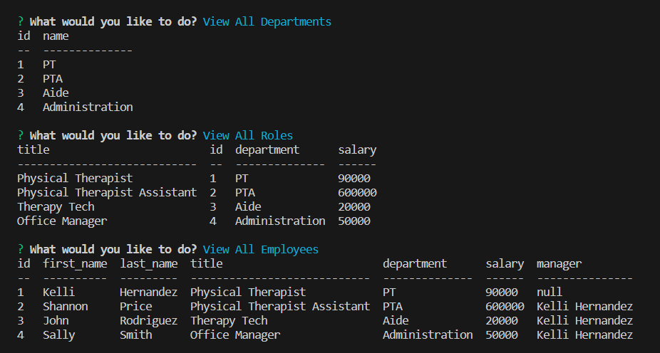

# Employee-Tracker
## Description
A command-line content management systems (CMS) application to manage a company's employee database, using Node.js, Inquirer, and MySQL.
## Table of Contents
- [Installation](#installation)
- [Usage](#usage)
- [Credits](#credits)
- [License](#license)
- [Badges](#badges)
- [Tests](#tests)
- [Questions](#questions)

## Installation
To use this project, you will need to first install dependencies. You can do this by using the following command in the terminal:   `$ npm i` 

## Usage
You can view a video demonstration of how to use this application [here.](https://drive.google.com/file/d/1ODU_yxstKzTUIeQPkN6Q4vZKEU9acf5i/view?usp=share_link)  
To run the program, use the following command in the terminal:  `$ node index.js`  OR   `$ npm start`  
You will be prompted with several options view employee data, add data, or update data.     

    
    
    
    

## Credits
Worked with tutor Chris Baird to debug functions

## License
MIT License

## Badges

## Tests
N/A 

## Questions
GitHub Profile: [github.com/shannonkprice00](https://github.com/shannonkprice00) 
For further questions, you can reach me at shannonkprice00@gmail.com

## Credits
Tutorials Followed: 
[Tutorial using JOINS](https://learn.microsoft.com/en-us/sql/relational-databases/performance/joins?view=sql-server-ver16) 
[Tutorial with additional JOIN details](https://www.makeuseof.com/how-to-query-multiple-database-tables-with-sql-joins/?newsletter_popup=1) 
[Tutorial for dynamically adding choices to inquirer list prompt](https://stackoverflow.com/questions/66626936/inquirer-js-populate-list-choices-from-sql-database) 
